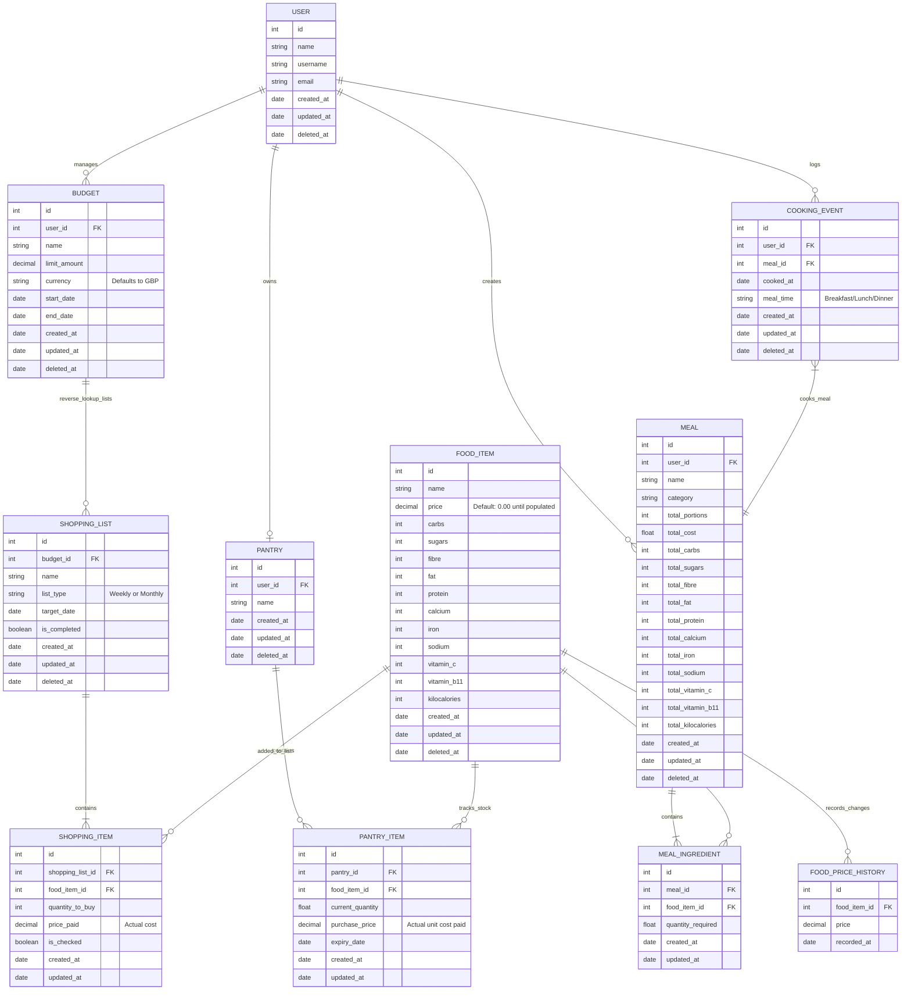

```mermaid
erDiagram
    USER ||--o{ BUDGET : manages
    USER ||--o| PANTRY : owns
    USER ||--o{ MEAL : creates
    USER ||--o{ COOKING_EVENT : logs

    PANTRY ||--o{ PANTRY_ITEM : contains
    FOOD_ITEM ||--o{ PANTRY_ITEM : tracks_stock
    FOOD_ITEM ||--o{ FOOD_PRICE_HISTORY : records_changes

    MEAL ||--|{ MEAL_INGREDIENT : contains
    FOOD_ITEM ||--o{ MEAL_INGREDIENT : used_in_recipe

    BUDGET ||--o{ SHOPPING_LIST : reverse_lookup_lists
    SHOPPING_LIST ||--|{ SHOPPING_ITEM : contains
    FOOD_ITEM ||--o{ SHOPPING_ITEM : added_to_list

    COOKING_EVENT }|--|| MEAL : cooks_meal

    USER {
        int id
        string name
        string username
        string email
        date created_at
        date updated_at
        date deleted_at
    }
    FOOD_ITEM {
        int id
        string name
        decimal price "Default: 0.00 until populated"
        int carbs
        int sugars
        int fibre
        int fat
        int protein
        int calcium
        int iron
        int sodium
        int vitamin_c
        int vitamin_b11
        int kilocalories
        date created_at
        date updated_at
        date deleted_at
    }
    FOOD_PRICE_HISTORY {
        int id
        int food_item_id FK
        decimal price
        date recorded_at
    }
    PANTRY {
        int id
        int user_id FK
        string name
        date created_at
        date updated_at
        date deleted_at
    }
    PANTRY_ITEM {
        int id
        int pantry_id FK
        int food_item_id FK
        float current_quantity
        decimal purchase_price "Actual unit cost paid"
        date expiry_date
        date created_at
        date updated_at
    }
    MEAL {
        int id
        int user_id FK
        string name
        string category
        int total_portions
        float total_cost
        int total_carbs
        int total_sugars
        int total_fibre
        int total_fat
        int total_protein
        int total_calcium
        int total_iron
        int total_sodium
        int total_vitamin_c
        int total_vitamin_b11
        int total_kilocalories
        date created_at
        date updated_at
        date deleted_at
    }
    MEAL_INGREDIENT {
        int id
        int meal_id FK
        int food_item_id FK
        float quantity_required
        date created_at
        date updated_at
    }
    BUDGET {
        int id
        int user_id FK
        string name
        decimal limit_amount
        string currency "Defaults to GBP"
        date start_date
        date end_date
        date created_at
        date updated_at
        date deleted_at
    }
    SHOPPING_LIST {
        int id
        int budget_id FK
        string name
        string list_type "Weekly or Monthly"
        date target_date
        boolean is_completed
        date created_at
        date updated_at
        date deleted_at
    }
    SHOPPING_ITEM {
        int id
        int shopping_list_id FK
        int food_item_id FK
        int quantity_to_buy
        decimal price_paid "Actual cost"
        boolean is_checked
        date created_at
        date updated_at
    }
    COOKING_EVENT {
        int id
        int user_id FK
        int meal_id FK
        date cooked_at
        string meal_time "Breakfast/Lunch/Dinner"
        date created_at
        date updated_at
        date deleted_at
    }
```